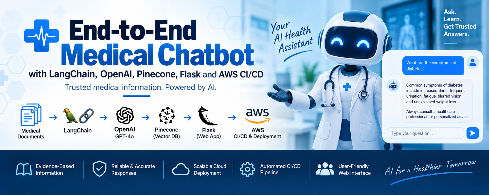
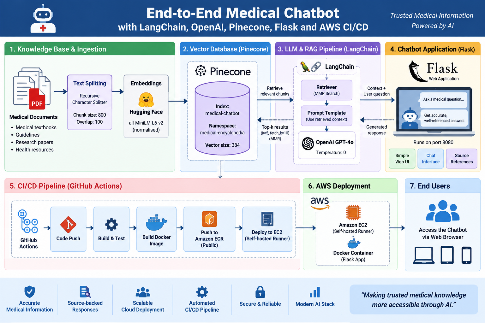

# End-to-End Medical Chatbot with LangChain, OpenAI, Pinecone, Flask & AWS CI/CD



An end-to-end **Retrieval-Augmented Generation (RAG) medical chatbot** that combines LangChain, OpenAI GPT-4o, Hugging Face embeddings, Pinecone vector search, Flask, Docker, GitHub Actions, and AWS.

The application loads medical reference material from PDF files, converts the content into vector embeddings, stores the embeddings in Pinecone, retrieves relevant passages for each user question, and uses GPT-4o to generate concise answers grounded in the retrieved context. The application is exposed through a Flask web interface and can be containerised with Docker and deployed automatically to Amazon EC2 through GitHub Actions and Amazon ECR Public.

> **Medical disclaimer:** This project is intended for educational and demonstration purposes only. It does not provide medical diagnosis, treatment, or professional medical advice.

---

## Table of Contents

- [Project Overview](#project-overview)
- [Architecture](#architecture)
- [Technology Stack](#technology-stack)
- [Key Features](#key-features)
- [Repository Structure](#repository-structure)
- [How the RAG Pipeline Works](#how-the-rag-pipeline-works)
- [Installation](#installation)
- [Environment Variables](#environment-variables)
- [Create and Populate the Pinecone Index](#create-and-populate-the-pinecone-index)
- [Run the Application Locally](#run-the-application-locally)
- [Run with Docker](#run-with-docker)
- [AWS CI/CD Deployment](#aws-cicd-deployment)
- [GitHub Actions Secrets](#github-actions-secrets)
- [EC2 Self-Hosted Runner](#ec2-self-hosted-runner)
- [Application Routes](#application-routes)
- [Production Improvements](#production-improvements)
- [Skills Demonstrated](#skills-demonstrated)

---

## Project Overview

Large Language Models can generate useful responses, but they may also answer from information that is not part of an application's trusted knowledge source. This project addresses that problem with **Retrieval-Augmented Generation (RAG)**.

The chatbot uses a medical PDF knowledge base. During ingestion, the PDF content is loaded, cleaned, divided into overlapping text chunks, converted to embeddings, and stored in Pinecone.

At query time:

1. The user submits a medical question through the Flask web interface.
2. The question is embedded using the same Hugging Face embedding model used during document ingestion.
3. Pinecone performs vector retrieval using **Maximum Marginal Relevance (MMR)**.
4. The most relevant medical passages are returned to LangChain.
5. LangChain combines the retrieved context with the user's question.
6. OpenAI GPT-4o generates a concise, context-grounded answer.
7. Flask returns the answer to the browser.

The system prompt explicitly instructs the model to use only retrieved context, avoid unsupported claims, avoid personalised diagnosis, explain medical terminology when useful, and acknowledge when the available information is insufficient.

---

## Architecture



---

## Technology Stack

| Category | Technology |
| --- | --- |
| Programming Language | Python 3.10 |
| Web Framework | Flask 3.1.1 |
| LLM | OpenAI GPT-4o |
| LLM Integration | `langchain-openai` |
| GenAI Framework | LangChain |
| Retrieval Chain | LangChain retrieval + document-stuffing chain |
| Embeddings | Hugging Face Sentence Transformers |
| Embedding Model | `sentence-transformers/all-MiniLM-L6-v2` |
| Embedding Dimension | 384 |
| Vector Database | Pinecone |
| Retrieval Strategy | Maximum Marginal Relevance (MMR) |
| PDF Processing | PyPDF / LangChain `PyPDFLoader` |
| Text Splitting | `RecursiveCharacterTextSplitter` |
| Frontend | HTML, CSS, JavaScript, Bootstrap, jQuery |
| Containerisation | Docker |
| CI/CD | GitHub Actions |
| Container Registry | Amazon ECR Public |
| Compute | Amazon EC2 |
| Cloud Platform | AWS |

---

## Key Features

- Retrieval-Augmented Generation for medical question answering
- PDF-based medical knowledge ingestion
- Automatic filtering of empty document pages
- Preservation of PDF source and page metadata
- Recursive text chunking with configurable separators
- Normalised Hugging Face embeddings
- Pinecone serverless vector index
- Dedicated Pinecone namespace for medical content
- Maximum Marginal Relevance retrieval for more diverse results
- GPT-4o response generation with temperature set to zero
- Prompt rules designed to reduce unsupported medical claims
- Flask-based browser chat interface
- Docker containerisation
- Automated image build and publication through GitHub Actions
- Deployment to an EC2-hosted self-hosted GitHub Actions runner
- Amazon ECR Public container image storage

---

## Repository Structure

```text
medical-chatbot-with-langchain/
├── .github/
│   └── workflows/
│       └── cicd.yaml
├── .vscode/
│   └── settings.json
├── data/
│   └── Medical_book.pdf
├── research/
│   └── experiment.ipynb
├── src/
│   ├── __init__.py
│   ├── helper.py
│   └── prompt.py
├── static/
│   └── style.css
├── templates/
│   └── chat.html
├── .env
├── .gitignore
├── Dockerfile
├── app.py
├── README.md
├── requirements.txt
├── setup.py
├── store_index.py
└── template.sh
```

### Important Files

| File | Purpose |
| --- | --- |
| `app.py` | Flask application and runtime RAG pipeline |
| `store_index.py` | Loads the PDFs, creates the Pinecone index, and stores embeddings |
| `src/helper.py` | PDF loading, metadata filtering, text splitting, and embedding utilities |
| `src/prompt.py` | Medical assistant system prompt |
| `templates/chat.html` | Browser chatbot interface |
| `static/style.css` | Chatbot styling |
| `Dockerfile` | Container definition |
| `.github/workflows/cicd.yaml` | GitHub Actions CI/CD pipeline |
| `requirements.txt` | Python dependencies |
| `research/experiment.ipynb` | Experimentation and development notebook |
| `setup.py` | Local Python package metadata |

---

## How the RAG Pipeline Works

### 1. Load Medical PDF Files

`src/helper.py` loads all PDF files from the `data/` directory with `DirectoryLoader` and `PyPDFLoader`.

```python
documents = load_pdf_files(data="data/")
```

The loader uses:

```python
DirectoryLoader(
    data,
    glob="*.pdf",
    loader_cls=PyPDFLoader
)
```

---

### 2. Filter Documents

The helper function removes empty pages and reduces metadata to the fields needed by the application:

- `source`
- `page`

This keeps the document objects compact while retaining traceability to the original PDF location.

---

### 3. Split Documents into Chunks

Documents are split using `RecursiveCharacterTextSplitter`:

```python
RecursiveCharacterTextSplitter(
    chunk_size=800,
    chunk_overlap=100,
    separators=["\n\n", "\n", ". ", " ", ""]
)
```

The 100-character overlap helps preserve context across adjacent chunks.

---

### 4. Generate Embeddings

The project uses:

```text
sentence-transformers/all-MiniLM-L6-v2
```

The embedding helper enables normalisation:

```python
HuggingFaceEmbeddings(
    model_name="sentence-transformers/all-MiniLM-L6-v2",
    encode_kwargs={"normalize_embeddings": True}
)
```

The model produces **384-dimensional vectors**.

---

### 5. Create the Pinecone Index

`store_index.py` creates the index only when it does not already exist.

Configuration:

```text
Index name: medical-chatbot
Namespace: medical-encyclopedia
Dimension: 384
Metric: cosine
Cloud: AWS
Region: us-east-1
```

The document chunks are then embedded and stored in Pinecone through `PineconeVectorStore.from_documents()`.

---

### 6. Connect to the Existing Vector Store

When `app.py` starts, it connects to the existing index:

```python
docsearch = PineconeVectorStore.from_existing_index(
    index_name="medical-chatbot",
    embedding=embeddings,
    namespace="medical-encyclopedia"
)
```

The Pinecone index therefore needs to be populated before normal application use.

---

### 7. Retrieve Medical Context with MMR

The chatbot uses **Maximum Marginal Relevance** rather than plain top-k similarity search:

```python
retriever = docsearch.as_retriever(
    search_type="mmr",
    search_kwargs={
        "k": 5,
        "fetch_k": 10
    }
)
```

Pinecone first considers up to 10 candidate chunks and the retriever returns 5 results designed to balance relevance with diversity.

---

### 8. Generate the Response

The OpenAI model is configured as:

```python
ChatOpenAI(
    model="gpt-4o",
    temperature=0
)
```

The application creates:

1. a `ChatPromptTemplate`;
2. a document-combination chain;
3. a LangChain retrieval chain.

The system prompt requires answers to remain grounded in the retrieved context and instructs the model not to provide personalised diagnoses.

---

## Installation

### Prerequisites

Before running the project, install or obtain:

- Python 3.10+
- Git
- Docker, if using containers
- OpenAI API access
- Pinecone account and API access
- AWS account, if deploying through the included CI/CD workflow

### 1. Clone the Repository

```bash
git clone https://github.com/OlumideOlumayegun/medical-chatbot-with-langchain.git
cd medical-chatbot-with-langchain
```

### 2. Create a Virtual Environment

#### Linux/macOS

```bash
python3 -m venv venv
source venv/bin/activate
```

#### Windows PowerShell

```powershell
python -m venv venv
.\venv\Scripts\Activate.ps1
```

### 3. Upgrade pip

```bash
python -m pip install --upgrade pip
```

### 4. Install Dependencies

```bash
pip install -r requirements.txt
```

The repository installs itself in editable mode because `requirements.txt` contains:

```text
-e .
```

---

## Environment Variables

Create a local `.env` file in the project root:

```env
PINECONE_API_KEY=your_pinecone_api_key
OPENAI_API_KEY=your_openai_api_key
```

The application loads these variables with `python-dotenv`.

The `.gitignore` already includes `.env`, so local credentials should not be intentionally committed to source control.

> Never put real API keys, AWS credentials, tokens, or other secrets in source files, notebooks, documentation, commit history, or Docker images.

---

## Create and Populate the Pinecone Index

Before starting the chatbot for the first time, run:

```bash
python store_index.py
```

This script:

1. Loads PDF files from `data/`.
2. Removes empty pages and reduces metadata.
3. Splits the content into 800-character chunks with 100-character overlap.
4. Generates 384-dimensional Hugging Face embeddings.
5. Connects to Pinecone.
6. Creates the `medical-chatbot` index when it does not already exist.
7. Uses AWS `us-east-1` as the Pinecone serverless region.
8. Stores vectors in the `medical-encyclopedia` namespace.

### Re-indexing

`PineconeVectorStore.from_documents()` writes the document chunks to the configured index. If the ingestion script is repeatedly run against the same content, review the resulting vector records and your desired update strategy to avoid unintended duplication.

---

## Run the Application Locally

Start Flask:

```bash
python app.py
```

The current application configuration listens on:

```text
http://localhost:8080
```

or:

```text
http://127.0.0.1:8080
```

The Flask server binds to:

```text
0.0.0.0:8080
```

### Current Development Configuration

`app.py` currently starts Flask with:

```python
app.run(
    host="0.0.0.0",
    port=8080,
    debug=True
)
```

`debug=True` is useful for local development but should be disabled in production.

---

## Run with Docker

### Build the Docker Image

```bash
docker build -t medical-chatbot .
```

### Run the Container

```bash
docker run -d \
  --name medical-chatbot \
  -p 8080:8080 \
  -e PINECONE_API_KEY="$PINECONE_API_KEY" \
  -e OPENAI_API_KEY="$OPENAI_API_KEY" \
  medical-chatbot
```

Open:

```text
http://localhost:8080
```

### Dockerfile

The project uses a Python 3.10 slim base image:

```dockerfile
FROM python:3.10-slim-buster

WORKDIR /app

COPY . /app

RUN pip install -r requirements.txt

CMD ["python3", "app.py"]
```

---

## AWS CI/CD Deployment

The workflow is defined in:

```text
.github/workflows/cicd.yaml
```

It runs automatically when code is pushed to:

```text
main
```

The pipeline contains two dependent jobs.

### Continuous Integration

Runs on a GitHub-hosted Ubuntu runner.

The job:

1. Checks out the repository.
2. Configures AWS credentials.
3. Logs in to **Amazon ECR Public**.
4. Builds the Docker image.
5. Tags the image as `latest`.
6. Pushes the image to the configured ECR Public repository.

### Continuous Deployment

The deployment job depends on successful completion of CI.

It runs on:

```text
[self-hosted, linux, x64]
```

This is intended to be an EC2 instance configured as a GitHub Actions self-hosted runner.

The deployment job:

1. Checks out the repository.
2. Configures AWS credentials.
3. Logs in to Amazon ECR Public.
4. Starts the `latest` Docker image.
5. Injects the required environment variables.
6. Publishes container port `8080` on EC2 port `8080`.

---

## GitHub Actions Secrets

The workflow expects the following GitHub Repository Secrets:

| Secret | Purpose |
| --- | --- |
| `AWS_ACCESS_KEY_ID` | AWS API authentication |
| `AWS_SECRET_ACCESS_KEY` | AWS API authentication |
| `AWS_DEFAULT_REGION` | AWS region configuration |
| `ECR_REPO` | Amazon ECR Public repository identifier |
| `PINECONE_API_KEY` | Pinecone authentication |
| `OPENAI_API_KEY` | OpenAI API authentication |

Configure them under:

```text
GitHub Repository
→ Settings
→ Secrets and variables
→ Actions
```

For a production implementation, prefer **GitHub OpenID Connect (OIDC)** with a least-privilege AWS IAM role instead of long-lived AWS access keys.

---

## EC2 Self-Hosted Runner

The included CD job assumes that the EC2 host:

- runs Linux x64;
- has Docker installed;
- has Docker running;
- is registered as a GitHub Actions self-hosted runner;
- can access Amazon ECR Public;
- can reach Pinecone and OpenAI APIs;
- allows inbound traffic to the application endpoint where appropriate.

Typical Docker installation on Ubuntu:

```bash
curl -fsSL https://get.docker.com -o get-docker.sh
sudo sh get-docker.sh
sudo usermod -aG docker ubuntu
```

Sign out and back in, or otherwise refresh group membership, before using Docker without `sudo`.

The self-hosted runner can then be registered using the commands generated by GitHub under:

```text
Repository Settings
→ Actions
→ Runners
→ New self-hosted runner
```

---

## Application Routes

### `GET /`

Renders:

```text
templates/chat.html
```

This is the chatbot user interface.

### `POST /get`

Accepts the form field:

```text
msg
```

The handler passes the question to the RAG chain:

```python
response = rag_chain.invoke({"input": msg})
```

and returns:

```python
response["answer"]
```

to the browser.

The current frontend uses jQuery/AJAX to submit the user's message without refreshing the page.

---

## System Prompt Behaviour

The medical assistant prompt contains several important constraints:

- use only retrieved context;
- do not introduce unsupported facts;
- explicitly state when the available material is insufficient;
- identify ambiguity or conflicting sources;
- explain technical medical terminology in plain language when useful;
- avoid personalised diagnosis;
- keep answers concise and factual;
- indicate supporting source/page metadata where available.

These constraints improve grounding, but prompt instructions alone are not sufficient for clinical safety.

---

### Recommended AWS Authentication

Replace long-lived GitHub-stored AWS access keys with:

- GitHub Actions OIDC;
- an AWS IAM role;
- least-privilege policies.

### Flask Production Configuration

The current code enables Flask debug mode. Production deployments should:

- disable `debug=True`;
- use a production WSGI server such as Gunicorn;
- add HTTPS;
- use a reverse proxy or Application Load Balancer;
- implement authentication and rate limiting where required.

### Medical Application Safety

For any real healthcare use, additional safeguards would be required, including clinical validation, privacy and data-protection controls, secure handling of personal data, auditability, model evaluation, emergency-query handling, human oversight, and appropriate regulatory assessment.

---

## Production Improvements

Potential next steps include:

- Add source citations directly to chatbot responses.
- Render PDF source and page metadata in the UI.
- Add conversation memory for follow-up questions.
- Add metadata filtering.
- Add reranking after Pinecone retrieval.
- Add RAG evaluation using retrieval and answer-quality metrics.
- Add unit tests and integration tests.
- Add CI test stages before Docker publication.
- Add dependency and container vulnerability scanning.
- Replace `latest`-only deployment with immutable version or Git-SHA tags.
- Stop/remove the previous container before starting a replacement.
- Add Docker health checks.
- Add readiness and liveness checks.
- Add automated rollback logic.
- Use GitHub OIDC for AWS authentication.
- Pin GitHub Actions to current supported versions or immutable commit SHAs.
- Replace deprecated GitHub Actions output syntax where applicable.
- Add Gunicorn.
- Disable Flask debug mode.
- Add application logging, observability, metrics, and tracing.
- Add authentication and rate limiting.
- Add input validation and robust exception handling.
- Add a reverse proxy or AWS Application Load Balancer.
- Configure HTTPS/TLS.
- Add automated cleanup and lifecycle policies for container images.
- Add stronger medical-safety guardrails before any production healthcare use.

---

## Skills Demonstrated

This project demonstrates hands-on experience across **Generative AI, Python, DevOps, and AWS Cloud Engineering**, including:

- Retrieval-Augmented Generation
- LLM application development
- LangChain
- OpenAI API integration
- Prompt engineering
- Hugging Face sentence-transformer embeddings
- Vector databases
- Pinecone
- Semantic retrieval
- Maximum Marginal Relevance retrieval
- PDF document ingestion
- Text chunking
- Flask web development
- HTML/CSS/JavaScript
- Docker
- Git and GitHub
- GitHub Actions
- CI/CD automation
- Amazon ECR Public
- Amazon EC2
- Self-hosted CI/CD runners
- AWS IAM and deployment automation

---

## Author

**Olumide Olumayegun (PhD)**

GitHub: [OlumideOlumayegun](https://github.com/OlumideOlumayegun)

Repository: [medical-chatbot-with-langchain](https://github.com/OlumideOlumayegun/medical-chatbot-with-langchain)